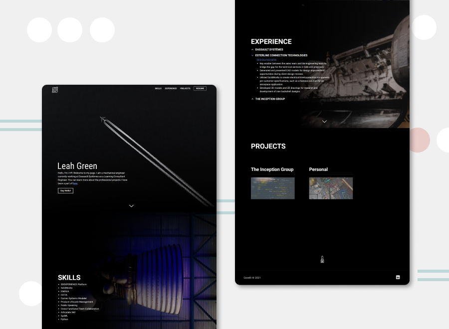
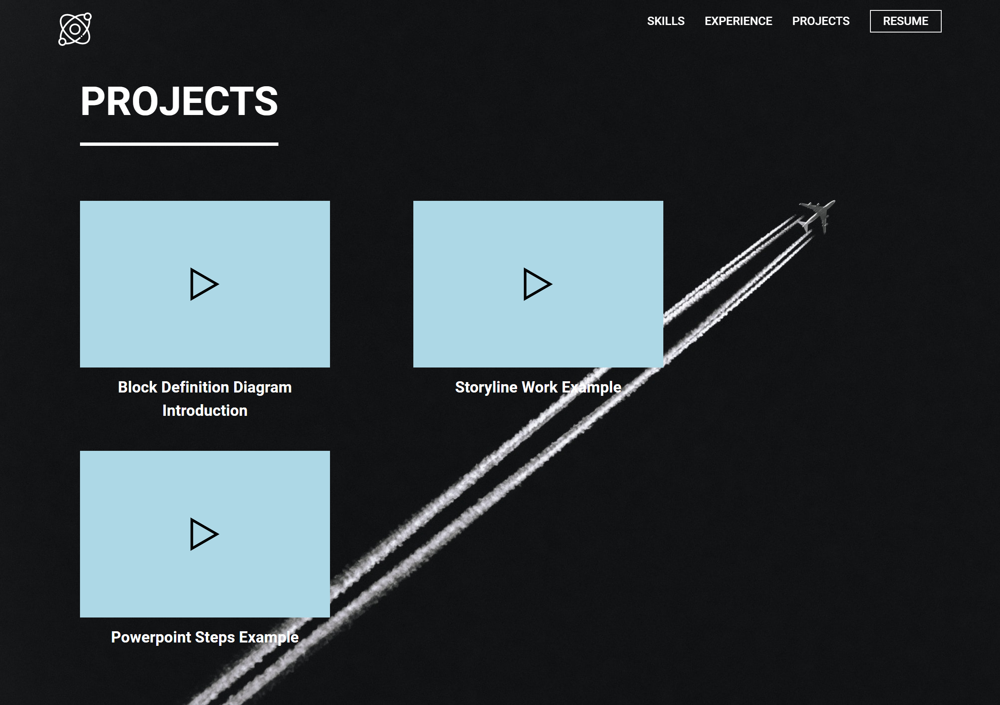

# ENGINEER'S PORTFOLIO
 
A multi-page aerospace themed portfolio used to demonstrate candidates skills and catch the eye of top space companies. Utilized CSS animations that were similar to sites such as SpaceX and Blue Origin as these were the companies being targeted.
 
live: https://luisportfolio.web.app/
 
## Table of contents
 
- [Overview](#overview)
  - [The challenge](#the-challenge)
  - [Screenshot](#screenshot)
- [My process](#my-process)
  - [Built with](#built-with)
  - [What I learned](#what-i-learned)
  - [Continued development](#continued-development)
- [Author](#author)
- [Acknowledgments](#acknowledgments)
 
## Overview
 
### The challenge
 
- A couple minor challenges. One was the time constraint as it needed to be completed and sent back within two days. Additionally, there were frequent changes with what was needed for this portfolio, such as adding videos, integrating powerpoint slides and expanding the overall portfolio. This required more time for development than what was initially expected. These specific pages were sent directly to the hiring manager as they contained private information. They are not listed within this repo/live, nor is the content that they contained, however, you can view a screenshot of it below.
- I do not take credit for the image slideshow UI. Because of the time crunch, I referenced w3schools.com's slideshow and manipulated the code to fit our needs and save an hour or two. Although I do feel confident in building something of similar functionality if given the time to do so.
 
### Screenshot
 
Landing Page:

 
Powerpoint and Video Page:

 
 
## My process
 
### Built with
 
- Semantic HTML
- SCSS
- JavaScript
- CSS animations
 
### What I learned
 
- Pre-creating designs in Sketch/Figma is the way to go
- Always outline the expectations before starting to create realistic timelines
- How to manipulate inline SVG paths and shapes
- How to add MS Powerpoint frames
- Build on reading other published code
 
### Continued development

- First off, I would have liked to place all the pages deviating from index.html into a page folder but it slipped my mind when I was developing. I didn't feel like it would make that great of a difference. When I go back to add content or create a new iteration, I plan on reorganizing them into folders and correcting the relative paths.

- In the future, I would like to revamp this website starting with the design being built out in a design software. Knowing what I know now about consistency with design, I would go back and make sure to utilize the same values for properties such as margin, padding and font-families. This would allow the flow from top to bottom of the page feel less chaotic.
 
## Author
 
- Website - [Alisar Fares-Boulos](https://www.alisarfaresboulos.com)
 
## Acknowledgments
 
Design inspired by SpaceX and Blue Origin Sites.
https://www.spacex.com/
https://www.blueorigin.com/
 
StackOverflow users for constructing the fade in mobile navigation and underlining animation that matched that of the SpaceX site.
https://stackoverflow.com/